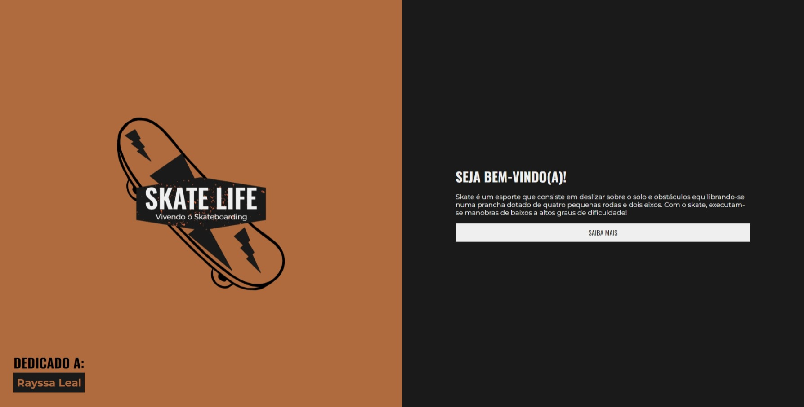
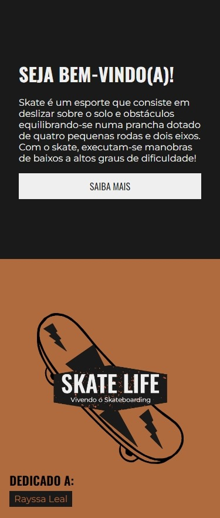
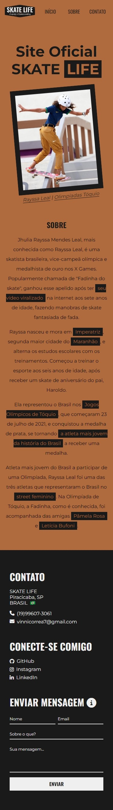

# SKATE LIFE

A ideia do site era apenas mostrar a beleza por dentro do esporte Skate, mas ao ir criando-o fiz uma dedicação a Rayssa Leal.
## Preview do projeto

  
  

 

  
  

## Funcionalidades

- Disponível para Mobiel e Desktop
- Preview em tempo real

## Feedback

Se você tiver algum feedback, por favor deixe saber por meio de vinnicorrea7@gmail.com

## Autor

- [@vinicius](https://www.github.com/viniciuswx)

## 🔗 Links

## 🛠 Habilidades
HTML e CSS

## Aprendizados

Aprendi a colocar as boas práticas do HTML (HTML semântico) e CSS (responsividade).

